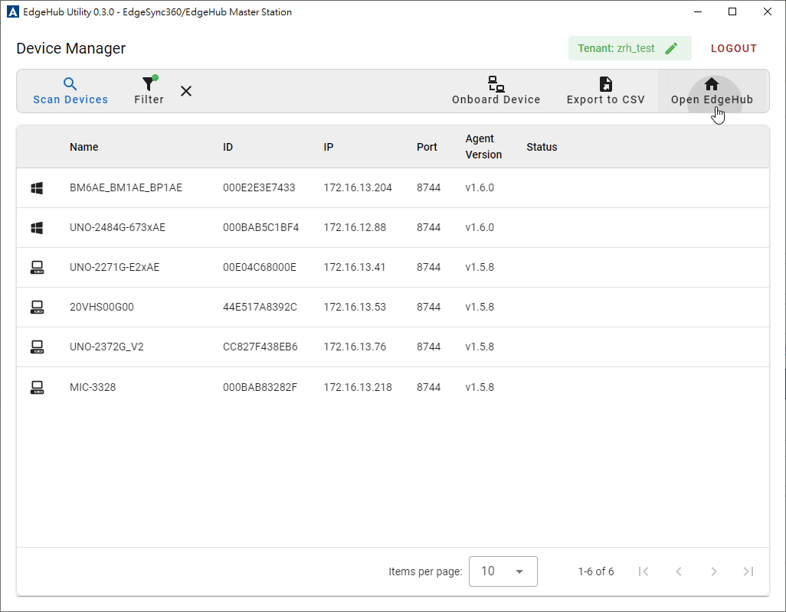

# EdgeHub UI App

EdgeHub UI is an application for batch creating and onboarding devices.

## UI Overview

The main interface of the EdgeHub UI consists of a toolbar with various action buttons, a device table displaying discovered devices, and a pagination control at the bottom. Users can interact with the UI to scan, filter, onboard, export devices, and switch tenants.

## Features

- **Scan Devices**: Search for supported devices using a discovery protocol. (It uses mDNS to browse for devices of type `computer` with the service type `_edgehub._tcp.local` by default).

- **Filter**: Click the **Filter** button to open a dialog where you can select specific devices to filter. The dialog displays a list of available devices with checkboxes for selection. You can use the **Select All** option to quickly select all devices or manually check individual devices. Use the search bar at the top of the dialog to find specific devices by name or ID. Once your selection is made, click **Apply** to filter the Device Table based on your selection. To cancel the action, click **Cancel**.

  

  To reset the filter, click the `X` button next to **Filter** in the main UI.

  

- **Onboard Device**: Onboard selected devices to the `selected tenant` of the `target station` after logging in. (This process involves creating the device, binding it to a DeviceOn device, obtaining device credentials, including DPM and DeviceOn, and connecting the device to the cloud using the provided credentials).
- **Export to CSV**: Generate a `Mass Deployment CSV` for the selected devices.
- **Open EdgeHub**: This feature opens a new window to connect to the EdgeHub webpage of the `selected tenant of the station`. Users must be logged in to the EdgeHub UI for this function to work. Once the remote EdgeHub (cloud) webpage is accessed, users do not need to log in again if they are already logged into the Edge UI. If the EdgeHub webpage is logged out, the window will automatically close, and a login prompt will appear in the EdgeHub UI to allow users to re-authenticate.

  

- **Login**: Choose a station to log in to and select the tenant for interaction.
- **Switch Tenant**: Switch the tenant after logging in to a station.

  

- **Notifications for New Devices**: When new device data is available, a notification will be displayed prompting the user to either **LOAD NEW DATA** or **IGNORE**. Choosing **LOAD NEW DATA** will refresh the Device Table with the new data, while **IGNORE** will allow the user to dismiss the notification. Users can re-access dismissed notifications through the notification button at the top right corner of the UI.

  

- **Logout**: Log out of the current session to ensure account security.

  

## Device Table Columns

- **Name**: The name of the discovered device.
- **ID**: A unique identifier assigned to the device.
- **IP**: The IP address of the device on the local network.
- **Port**: The port number through which the device communicates.
- **Agent Version**: The current version of the agent software running on the device.
- **Status**: Displays the current onboard status or any relevant error messages related to the device. Examples include:
  - **Ready**: Indicates that the device has been successfully onboarded.
  - **Not Supported**: Indicates that the device cannot be onboarded due to compatibility issues.
  - **Onboarding Process**: A busy indicator will be shown during the onboarding process, indicating that the action is in progress.
  - **Error Messages**: Shows specific issues, such as `mqtt client connection error: bad user name or password`, that may arise during the onboarding process.

  

## User Interaction

### Filter Devices

Click on the **Filter** button to open a dialog that displays a list of devices. Select the devices you want to filter by checking the corresponding boxes and click **Apply** to update the table view. To reset the filter, click the `X` next to the **Filter** button.

### Onboarding Devices

To onboard devices, ensure you are logged in and have selected a tenant. Click **Onboard Device** to start the onboarding process, which will:

1. Create the device on the cloud service.
2. Bind the device to the corresponding DeviceOn entry.
3. Retrieve device credentials.
4. Establish a connection between the device and the cloud.

### Export to CSV

Select the devices you want to export and click **Export to CSV** to generate a CSV file containing the relevant data for mass deployment.

## Pagination Control

The pagination control at the bottom of the table allows you to:

- **Change the number of items per page**: Use the dropdown menu to select how many items to display on each page.
- **Navigate between pages**: Click the arrow buttons to move to the previous or next page.

## Tooltips and Icons

Some icons and elements have tooltips or visual indicators:

- **Green Dot**: (Badge on the Filter button): Indicates that a filter has been applied.
- **Icons**: Represent different device types or statuses.
